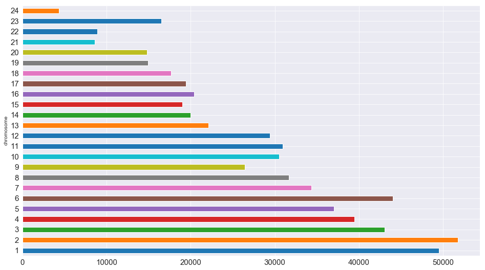

# Know Thyself: Using Data Science to Explore Your Own Genome
## DNA analysis with pandas and Selenium

<figure style="width: 900px">
  
  <figcaption>"Nosce te ipsum" ("know thyself"), an ancient maxim frequently associated with gory anatomical pop-up books of yore.</figcaption>
</figure>

[Image from the University of Cambridge](https://exhibitions.lib.cam.ac.uk/vesalius/artifacts/geminuss-flaps1/)

[23andme](https://www.23andme.com/) once offered me a free DNA and ancestry test kit if I participated in one of their clinical studies. In exchange for a cheek swab and baring my guts and soul in a score of questionnaires, I got my genome sequenced and gained access to myriad reports on where my ancestors were likely from, whom else on the site I might be related to, and what health conditions and traits I probably have inherited.

<figure style="width: 900px">
  
  <figcaption>Seriously?</figcaption>
</figure>

23andme already provides an overwhelming amount of consumer-ready infographics and tools, but I knew I could do more with the data. The intrepid may download their raw genetic data if they dare, so of course I poured it into pandas to [see what I could make of it](https://github.com/lorarjohns/DNA_pandas_selenium). 


```python
%matplotlib inline
import seaborn as sns
sns.set_style('darkgrid')
sns.color_palette('Spectral')
import matplotlib.pyplot as plt
```


```python
import numpy as np
import requests
import pandas as pd

import re
```


```python
from selenium import webdriver
from selenium.webdriver.support.ui import WebDriverWait
```

## Importing my DNA into pandas and exploring the genome

Looking at the .txt file, I could see that I was missing some genotype values, denoted with '--'. 

Most of the chromosomes are ints, but three are X, Y, and MT (for 'mitochondrial'). I needed to specify the data type properly so that pandas wouldn't throw an error when it found mixed data in the input. 

The other columns were fairly straightforward. I also wanted pandas to ignore the prefatory comments at the beginning of the file that consisted of lines beginning with an octothorpe.

The arguments I needed to pass, therefore, were:
* separator (tab-delimited)
* dtype (as a dict)
* na_values ('--') *(n.b.: I decided against this in the end to avoid dealing with more NaNs)*
* comment ('#')


```python
data = pd.read_csv('genome.txt', sep='\t', dtype={'rsid':'str', 'chromosome':'object', 'position':'int', 'genotype':'str'}, comment='#')


```


```python
print(data)
```

                   rsid chromosome  position genotype
    0       rs548049170          1     69869       TT
    1        rs13328684          1     74792       --
    2         rs9283150          1    565508       AA
    3           i713426          1    726912       --
    4       rs116587930          1    727841       GG
    5         rs3131972          1    752721       AG
    6        rs12184325          1    754105       CC

    ...             ...        ...       ...      ...

    [638531 rows x 4 columns]


A quick note on the column names:

* rsid stands for Reference SNP cluster ID. It identifies unique SNPs.

* SNPs are Single Nucleotide Polymorphisms ('snips'), locations in the genome that vary between individuals. They can influence disease risk and drug effects, tell you about your ancestry, and predict aspects of how you look and act.

* All humans have almost the same sequence of 3 billion DNA bases (A,C,G, or T) distributed between their 23 pairs of chromosomes. But at certain locations, some differences exist that researchers have declared meaningful, for medical or other reasons (like genealogy). 

I started to navigate my new DataFrame with basic exploratory data analysis and data cleaning.


```python
# Read the data into a pandas DataFrame and do some EDA
df = pd.DataFrame(data)
```


```python
df.head(25)
```

<div>
<style scoped>
    .dataframe tbody tr th:only-of-type {
        vertical-align: middle;
    }

    .dataframe tbody tr th {
        vertical-align: top;
    }

    .dataframe thead th {
        text-align: right;
    }
</style>
<table border="1" class="dataframe">
  <thead>
    <tr style="text-align: right;">
      <th></th>
      <th>rsid</th>
      <th>chromosome</th>
      <th>position</th>
      <th>genotype</th>
    </tr>
  </thead>
  <tbody>
    <tr>
      <th>0</th>
      <td>rs548049170</td>
      <td>1</td>
      <td>69869</td>
      <td>TT</td>
    </tr>
    <tr>
      <th>1</th>
      <td>rs13328684</td>
      <td>1</td>
      <td>74792</td>
      <td>--</td>
    </tr>
    <tr>
      <th>2</th>
      <td>rs9283150</td>
      <td>1</td>
      <td>565508</td>
      <td>AA</td>
    </tr>
    <tr>
      <th>3</th>
      <td>i713426</td>
      <td>1</td>
      <td>726912</td>
      <td>--</td>
    </tr>
    <tr>
      <th>4</th>
      <td>rs116587930</td>
      <td>1</td>
      <td>727841</td>
      <td>GG</td>
    </tr>
    <tr>
      <th>5</th>
      <td>rs3131972</td>
      <td>1</td>
      <td>752721</td>
      <td>AG</td>
    </tr>
    <tr>
      <th>6</th>
      <td>rs12184325</td>
      <td>1</td>
      <td>754105</td>
      <td>CC</td>
    </tr>
    <tr>
      <th>7</th>
      <td>rs12567639</td>
      <td>1</td>
      <td>756268</td>
      <td>AA</td>
    </tr>
    <tr>
      <th>8</th>
      <td>rs114525117</td>
      <td>1</td>
      <td>759036</td>
      <td>GG</td>
    </tr>
    <tr>
      <th>9</th>
      <td>rs12124819</td>
      <td>1</td>
      <td>776546</td>
      <td>AA</td>
    </tr>
    <tr>
      <th>10</th>
      <td>rs12127425</td>
      <td>1</td>
      <td>794332</td>
      <td>GG</td>
    </tr>
    <tr>
      <th>11</th>
      <td>rs79373928</td>
      <td>1</td>
      <td>801536</td>
      <td>TT</td>
    </tr>
    <tr>
      <th>12</th>
      <td>rs72888853</td>
      <td>1</td>
      <td>815421</td>
      <td>--</td>
    </tr>
    <tr>
      <th>13</th>
      <td>rs7538305</td>
      <td>1</td>
      <td>824398</td>
      <td>AA</td>
    </tr>
    <tr>
      <th>14</th>
      <td>rs28444699</td>
      <td>1</td>
      <td>830181</td>
      <td>AA</td>
    </tr>
    <tr>
      <th>15</th>
      <td>i713449</td>
      <td>1</td>
      <td>830731</td>
      <td>--</td>
    </tr>
    <tr>
      <th>16</th>
      <td>rs116452738</td>
      <td>1</td>
      <td>834830</td>
      <td>GG</td>
    </tr>
    <tr>
      <th>17</th>
      <td>rs72631887</td>
      <td>1</td>
      <td>835092</td>
      <td>TT</td>
    </tr>
    <tr>
      <th>18</th>
      <td>rs28678693</td>
      <td>1</td>
      <td>838665</td>
      <td>TT</td>
    </tr>
    <tr>
      <th>19</th>
      <td>rs4970382</td>
      <td>1</td>
      <td>840753</td>
      <td>CT</td>
    </tr>
    <tr>
      <th>20</th>
      <td>rs4475691</td>
      <td>1</td>
      <td>846808</td>
      <td>CC</td>
    </tr>
    <tr>
      <th>21</th>
      <td>rs72631889</td>
      <td>1</td>
      <td>851390</td>
      <td>GG</td>
    </tr>
    <tr>
      <th>22</th>
      <td>rs7537756</td>
      <td>1</td>
      <td>854250</td>
      <td>AA</td>
    </tr>
    <tr>
      <th>23</th>
      <td>rs13302982</td>
      <td>1</td>
      <td>861808</td>
      <td>GG</td>
    </tr>
    <tr>
      <th>24</th>
      <td>rs376747791</td>
      <td>1</td>
      <td>863130</td>
      <td>AA</td>
    </tr>
  </tbody>
</table>
</div>


```python
df.isna().any()
```


     rsid         False
    chromosome    False
    position      False
    genotype      False
    dtype: bool


```python
df.nunique()
```


     rsid         638531
    chromosome        25
    position      634934
    genotype          20
    dtype: int64


```python
# How many chromosomes am I missing by not 
# having a Y chromosome?
Y_chromosome = df[df.chromosome == 'Y']
```


```python
len(Y_chromosome)
```


    3733


I converted the letter chromosomes to numbers, cast them to ints, and created a dictionary to translate them back later so that I could better manipulate the data.


```python
df['chromosome'].unique()
```


    array(['1', '2', '3', '4', '5', '6', '7', '8', 
          '9', '10', '11', '12','13', '14', '15', 
          '16', '17', '18', '19', '20', '21', '22',
          'X','MT'], dtype=object)


```python
df['chromosome'] = df['chromosome'].apply(lambda x: 
  re.sub(r'X', r'23', x))
df['chromosome'] = df['chromosome'].apply(lambda x: 
  re.sub(r'MT', r'24', x))
```


```python
df['chromosome'] = df['chromosome'].apply(lambda x: 
  int(x))
```


```python
chromosome_dict = {1:'1', 2:'2', 3:'3', 4:'4', 5:'5', 
           6:'6', 7:'7', 8:'8', 9:'9', 10:'10', 
           11:'11', 12:'12', 13:'13', 14:'14', 
           15:'15', 16:'16', 17:'17', 18:'18', 
           19:'19', 20:'20', 21:'21', 22:'22', 
           23:'X', 24:'MT'}
```


```python
print(chromosome_dict)
display(df.info())
```

    {1: '1', 2: '2', 3: '3', 4: '4', 5: '5', 6: '6', 7: '7', 
     8: '8', 9: '9', 10: '10', 11: '11', 12: '12', 13: '13', 
     14: '14', 15: '15', 16: '16', 17: '17', 18: '18', 
     19: '19', 20: '20', 21: '21', 22: '22', 23: 'X', 
     24: 'MT'}

    <class 'pandas.core.frame.DataFrame'>
    Int64Index: 634798 entries, 0 to 638530

    Data columns (total 4 columns):

     rsid         634798 non-null object
    chromosome    634798 non-null int64
    position      634798 non-null int64
    genotype      634798 non-null object

    dtypes: int64(2), object(2)
    memory usage: 24.2+ MB

    None


There were 16,005 genotypes that I simply lacked:


```python
genotype_na = df[df.genotype == '--']
len(genotype_na)
```
    16005


### Some visualizations


```python
df[df.chromosome == 1].info()
```

    <class 'pandas.core.frame.DataFrame'>
    Int64Index: 49514 entries, 0 to 49513
    Data columns (total 4 columns):
     rsid         49514 non-null object
    chromosome    49514 non-null int64
    position      49514 non-null int64
    genotype      49514 non-null object
    dtypes: int64(2), object(2)
    memory usage: 1.9+ MB


```python
# Remove that pesky whitespace from the column name
df.rename({' rsid': 'rsid'}, axis='columns', inplace=True)
```

How many SNPs are there per chromosome?


```python
# We can do this manually with a for loop . . .
x = []
y = []
for k in chromosome_dict:
    x.append(k)
    y.append(len(df[df.chromosome == k]))
rsid_per_chromosome = dict(zip(x,y)) 
```

```python
rsid_per_chromosome
```

    {1: 49514,
     2: 51775,
     3: 43024,
     4: 39474,
     5: 37032,
     6: 44023,
     7: 34357,
     8: 31683,
     9: 26446,
     10: 30525,
     11: 30942,
     12: 29432,
     13: 22080,
     14: 19961,
     15: 19006,
     16: 20397,
     17: 19401,
     18: 17675,
     19: 14917,
     20: 14781,
     21: 8607,
     22: 8915,
     23: 16530,
     24: 4301}


```python
# . . . but pandas makes it a lot easier!
rsid_per_chromosome_series = df.groupby('chromosome')['rsid'].count()
rsid_per_chromosome_series.columns = ['chromosome', 'count']
```

```python
rsid_per_chromosome_series.plot.barh(figsize=(16,9), fontsize=15)
plt.show()
```

<figure style="width: 900px" "height: 900px">
  
  <figcaption>rsid per chromosome</figcaption>
</figure>


## Getting data on SNPs from SNPedia

To acquire more information about my DNA, I pulled files from [SNPedia](https://www.snpedia.com/index.php/SNPedia), a wiki investigating human genetics that gathers extensive data and cites to peer-reviewed scientific publications. SNPedia catalogues common, reproducible SNPs (or ones found in meta-analyses or studies of at least 500 patients), or those with other historic or medical significance.

The columns are:

* Unnamed: 0 (actually the SNP name)
* Magnitude (a subjective measure of interest)
* Repute (a subjective measure of whether the genotype is "good" or "bad" to have based on research, and blank for things like ancestry and eye color)
* Summary (a narrative description)


```python
snp_df = pd.read_csv('result.csv')
snp_df.head()
```

<div>
<style scoped>
    .dataframe tbody tr th:only-of-type {
        vertical-align: middle;
    }

    .dataframe tbody tr th {
        vertical-align: top;
    }

    .dataframe thead th {
        text-align: right;
    }
</style>
<table border="1" class="dataframe">
  <thead>
    <tr style="text-align: right;">
      <th></th>
      <th>Unnamed: 0</th>
      <th>Magnitude</th>
      <th>Repute</th>
      <th>Summary</th>
    </tr>
  </thead>
  <tbody>
    <tr>
      <th>0</th>
      <td>Rs661(A;A)</td>
      <td>9.0</td>
      <td>Bad</td>
      <td>early onset Alzheimer's disease</td>
    </tr>
    <tr>
      <th>1</th>
      <td>Rs6647(T;T)</td>
      <td>0.0</td>
      <td>Good</td>
      <td>Normal; two copies of Pi-M1V allele</td>
    </tr>
    <tr>
      <th>2</th>
      <td>Rs6647(C;C)</td>
      <td>0.0</td>
      <td>Good</td>
      <td>Normal; two copies of Pi-M1A allele</td>
    </tr>
    <tr>
      <th>3</th>
      <td>Rs1303(T;T)</td>
      <td>0.0</td>
      <td>Good</td>
      <td>common in clinvar</td>
    </tr>
    <tr>
      <th>4</th>
      <td>Rs28929471(G;G)</td>
      <td>0.0</td>
      <td>Good</td>
      <td>common in complete genomics</td>
    </tr>
  </tbody>
</table>
</div>

### Fun with regular expressions

To align with my original DataFrame, I created a genotype column and used regex to separate out the genotype, which was stitched onto the end of the SNP name.


```python
snp_df['genotype'] = snp_df['Unnamed: 0'].apply(lambda x: 
  re.sub(r'.*([AGCT]);([AGCT])\)', r'\1\2', x))
```


```python
snp_df.head()
```


<div>
<style scoped>
    .dataframe tbody tr th:only-of-type {
        vertical-align: middle;
    }

    .dataframe tbody tr th {
        vertical-align: top;
    }

    .dataframe thead th {
        text-align: right;
    }
</style>
<table border="1" class="dataframe">
  <thead>
    <tr style="text-align: right;">
      <th></th>
      <th>Unnamed: 0</th>
      <th>Magnitude</th>
      <th>Repute</th>
      <th>Summary</th>
      <th>genotype</th>
    </tr>
  </thead>
  <tbody>
    <tr>
      <th>0</th>
      <td>Rs661(A;A)</td>
      <td>9.0</td>
      <td>Bad</td>
      <td>early onset Alzheimer's disease</td>
      <td>AA</td>
    </tr>
    <tr>
      <th>1</th>
      <td>Rs6647(T;T)</td>
      <td>0.0</td>
      <td>Good</td>
      <td>Normal; two copies of Pi-M1V allele</td>
      <td>TT</td>
    </tr>
    <tr>
      <th>2</th>
      <td>Rs6647(C;C)</td>
      <td>0.0</td>
      <td>Good</td>
      <td>Normal; two copies of Pi-M1A allele</td>
      <td>CC</td>
    </tr>
    <tr>
      <th>3</th>
      <td>Rs1303(T;T)</td>
      <td>0.0</td>
      <td>Good</td>
      <td>common in clinvar</td>
      <td>TT</td>
    </tr>
    <tr>
      <th>4</th>
      <td>Rs28929471(G;G)</td>
      <td>0.0</td>
      <td>Good</td>
      <td>common in complete genomics</td>
      <td>GG</td>
    </tr>
  </tbody>
</table>
</div>


For consistency's sake, I renamed the columns to match my original DataFrame and made sure the rsids were all lower-case.


```python
new_cols = ['rsid', 'magnitude', 'repute', 
'summary', 'genotype']
snp_df.columns = new_cols
```

I used regex to clean up the rsid a little more, too (because I will take any excuse to use more regex).


```python
snp_df['rsid'] = snp_df['rsid'].map(lambda x : x.lower())
snp_df['rsid'] = snp_df['rsid'].map(lambda x : 
  re.sub(r'([a-z]{1,}[\d]+)\([agct];[agct]\)', 
  r'\1', x))
```


```python
snp_df.head()
```

<div>
<style scoped>
    .dataframe tbody tr th:only-of-type {
        vertical-align: middle;
    }

    .dataframe tbody tr th {
        vertical-align: top;
    }

    .dataframe thead th {
        text-align: right;
    }
</style>
<table border="1" class="dataframe">
  <thead>
    <tr style="text-align: right;">
      <th></th>
      <th>rsid</th>
      <th>magnitude</th>
      <th>repute</th>
      <th>summary</th>
      <th>genotype</th>
    </tr>
  </thead>
  <tbody>
    <tr>
      <th>0</th>
      <td>rs661</td>
      <td>9.0</td>
      <td>Bad</td>
      <td>early onset Alzheimer's disease</td>
      <td>AA</td>
    </tr>
    <tr>
      <th>1</th>
      <td>rs6647</td>
      <td>0.0</td>
      <td>Good</td>
      <td>Normal; two copies of Pi-M1V allele</td>
      <td>TT</td>
    </tr>
    <tr>
      <th>2</th>
      <td>rs6647</td>
      <td>0.0</td>
      <td>Good</td>
      <td>Normal; two copies of Pi-M1A allele</td>
      <td>CC</td>
    </tr>
    <tr>
      <th>3</th>
      <td>rs1303</td>
      <td>0.0</td>
      <td>Good</td>
      <td>common in clinvar</td>
      <td>TT</td>
    </tr>
    <tr>
      <th>4</th>
      <td>rs28929471</td>
      <td>0.0</td>
      <td>Good</td>
      <td>common in complete genomics</td>
      <td>GG</td>
    </tr>
  </tbody>
</table>
</div>


```python
snp_df.info()
```

    <class 'pandas.core.frame.DataFrame'>
    RangeIndex: 100 entries, 0 to 99
    Data columns (total 5 columns):
    rsid         100 non-null object
    magnitude    100 non-null float64
    repute       91 non-null object
    summary      96 non-null object
    genotype     100 non-null object
    dtypes: float64(1), object(4)
    memory usage: 4.0+ KB

I overwrote the null reputes and summaries.

```python
null_repute = snp_df[snp_df['repute'].isnull()]
null_summaries = snp_df[snp_df['summary'].isnull()]
null_repute_and_summaries = pd.concat([null_repute,null_summaries]).drop_duplicates().reset_index(drop=True)
display(null_repute_and_summaries)
```


<div>
<style scoped>
    .dataframe tbody tr th:only-of-type {
        vertical-align: middle;
    }

    .dataframe tbody tr th {
        vertical-align: top;
    }

    .dataframe thead th {
        text-align: right;
    }
</style>
<table border="1" class="dataframe">
  <thead>
    <tr style="text-align: right;">
      <th></th>
      <th>rsid</th>
      <th>magnitude</th>
      <th>repute</th>
      <th>summary</th>
      <th>genotype</th>
    </tr>
  </thead>
  <tbody>
    <tr>
      <th>0</th>
      <td>rs28931569</td>
      <td>4.0</td>
      <td>NaN</td>
      <td>high risk of emphysema</td>
      <td>CC</td>
    </tr>
    <tr>
      <th>1</th>
      <td>rs28929473</td>
      <td>0.0</td>
      <td>NaN</td>
      <td>NaN</td>
      <td>TT</td>
    </tr>
    <tr>
      <th>2</th>
      <td>rs28931572</td>
      <td>0.0</td>
      <td>NaN</td>
      <td>NaN</td>
      <td>AA</td>
    </tr>
    <tr>
      <th>3</th>
      <td>rs1801252</td>
      <td>3.0</td>
      <td>NaN</td>
      <td>NaN</td>
      <td>GG</td>
    </tr>
    <tr>
      <th>4</th>
      <td>rs8192466</td>
      <td>4.0</td>
      <td>NaN</td>
      <td>uncertain</td>
      <td>TT</td>
    </tr>
    <tr>
      <th>5</th>
      <td>rs4986852</td>
      <td>2.0</td>
      <td>NaN</td>
      <td>predisposition to breast cancer?</td>
      <td>AA</td>
    </tr>
    <tr>
      <th>6</th>
      <td>rs1800709</td>
      <td>2.0</td>
      <td>NaN</td>
      <td>predisposition to breast cancer?</td>
      <td>TT</td>
    </tr>
    <tr>
      <th>7</th>
      <td>rs28931592</td>
      <td>0.0</td>
      <td>NaN</td>
      <td>NaN</td>
      <td>TT</td>
    </tr>
    <tr>
      <th>8</th>
      <td>rs4986893</td>
      <td>2.1</td>
      <td>NaN</td>
      <td>poor metabolizer of several commonly prescribe...</td>
      <td>AA</td>
    </tr>
  </tbody>
</table>
</div>


```python
snp_df['repute'].fillna(value='Neutral', inplace=True)
snp_df['summary'].fillna(value='None', inplace=True)
```


```python
# No no NaNette
snp_df.isna().any()
```


    rsid         False
    magnitude    False
    repute       False
    summary      False
    genotype     False
    dtype: bool


# Merging my data with SNPedia

Appropriately enough, I did an inner join of the SNPedia DataFrame on my DNA to see what data, if any, it had on my particular genotypes.


```python
new_df = snp_df.merge(df, how='inner', on=['rsid', 'genotype'], suffixes=('_SNPedia', '_myDNA'))
```


```python
new_df.head(20)
```


<div>
<style scoped>
    .dataframe tbody tr th:only-of-type {
        vertical-align: middle;
    }

    .dataframe tbody tr th {
        vertical-align: top;
    }

    .dataframe thead th {
        text-align: right;
    }
</style>
<table border="1" class="dataframe">
  <thead>
    <tr style="text-align: right;">
      <th></th>
      <th>rsid</th>
      <th>magnitude</th>
      <th>repute</th>
      <th>summary</th>
      <th>genotype</th>
      <th>chromosome</th>
      <th>position</th>
    </tr>
  </thead>
  <tbody>
    <tr>
      <th>0</th>
      <td>rs1303</td>
      <td>0.0</td>
      <td>Good</td>
      <td>common in clinvar</td>
      <td>TT</td>
      <td>14</td>
      <td>94844843</td>
    </tr>
    <tr>
      <th>1</th>
      <td>rs17580</td>
      <td>2.5</td>
      <td>Bad</td>
      <td>a slightly reduced functionality form of Alpha...</td>
      <td>TT</td>
      <td>14</td>
      <td>94847262</td>
    </tr>
    <tr>
      <th>2</th>
      <td>rs28931580</td>
      <td>0.0</td>
      <td>Good</td>
      <td>common in clinvar</td>
      <td>AA</td>
      <td>12</td>
      <td>50344783</td>
    </tr>
    <tr>
      <th>3</th>
      <td>rs1042714</td>
      <td>0.0</td>
      <td>Good</td>
      <td>normal</td>
      <td>CC</td>
      <td>5</td>
      <td>148206473</td>
    </tr>
    <tr>
      <th>4</th>
      <td>rs1800888</td>
      <td>0.0</td>
      <td>Good</td>
      <td>normal</td>
      <td>CC</td>
      <td>5</td>
      <td>148206885</td>
    </tr>
    <tr>
      <th>5</th>
      <td>rs2303790</td>
      <td>0.0</td>
      <td>Good</td>
      <td>common in clinvar</td>
      <td>AA</td>
      <td>16</td>
      <td>57017292</td>
    </tr>
    <tr>
      <th>6</th>
      <td>rs5882</td>
      <td>2.0</td>
      <td>Bad</td>
      <td>Faster aging. Increased risk for Dementia. Les...</td>
      <td>AA</td>
      <td>16</td>
      <td>57016092</td>
    </tr>
    <tr>
      <th>7</th>
      <td>rs2230199</td>
      <td>2.0</td>
      <td>Bad</td>
      <td>2.5x+ risk of ARMD</td>
      <td>GG</td>
      <td>19</td>
      <td>6718387</td>
    </tr>
    <tr>
      <th>8</th>
      <td>rs28931608</td>
      <td>0.0</td>
      <td>Good</td>
      <td>common in clinvar</td>
      <td>GG</td>
      <td>7</td>
      <td>75614497</td>
    </tr>
    <tr>
      <th>9</th>
      <td>rs4986893</td>
      <td>0.0</td>
      <td>Good</td>
      <td>normal</td>
      <td>GG</td>
      <td>10</td>
      <td>96540410</td>
    </tr>
    <tr>
      <th>10</th>
      <td>rs28399504</td>
      <td>0.0</td>
      <td>Good</td>
      <td>normal</td>
      <td>AA</td>
      <td>10</td>
      <td>96522463</td>
    </tr>
    <tr>
      <th>11</th>
      <td>rs2234922</td>
      <td>0.0</td>
      <td>Good</td>
      <td>common in clinvar</td>
      <td>AA</td>
      <td>1</td>
      <td>226026406</td>
    </tr>
    <tr>
      <th>12</th>
      <td>rs28931614</td>
      <td>0.0</td>
      <td>Good</td>
      <td>common in clinvar</td>
      <td>GG</td>
      <td>4</td>
      <td>1806119</td>
    </tr>
    <tr>
      <th>13</th>
      <td>rs28933068</td>
      <td>0.0</td>
      <td>Good</td>
      <td>common in clinvar</td>
      <td>CC</td>
      <td>4</td>
      <td>1807371</td>
    </tr>
  </tbody>
</table>
</div>


### What's hiding in there?


```python
# Create a DataFrame for some subsets of genes
good_genes = new_df[new_df.repute == 'Good']
bad_genes = new_df[new_df.repute == 'Bad']
interesting_genes = new_df[new_df.magnitude > 4] # 4 is the threshold for "worth your time" given by SNPedia
```

I have plenty of "good" genotypes, but none with a nonzero magnitude.


```python
good_genes
```


<div>
<style scoped>
    .dataframe tbody tr th:only-of-type {
        vertical-align: middle;
    }

    .dataframe tbody tr th {
        vertical-align: top;
    }

    .dataframe thead th {
        text-align: right;
    }
</style>
<table border="1" class="dataframe">
  <thead>
    <tr style="text-align: right;">
      <th></th>
      <th>rsid</th>
      <th>magnitude</th>
      <th>repute</th>
      <th>summary</th>
      <th>genotype</th>
      <th>chromosome</th>
      <th>position</th>
    </tr>
  </thead>
  <tbody>
    <tr>
      <th>0</th>
      <td>rs1303</td>
      <td>0.0</td>
      <td>Good</td>
      <td>common in clinvar</td>
      <td>TT</td>
      <td>14</td>
      <td>94844843</td>
    </tr>
    <tr>
      <th>2</th>
      <td>rs28931580</td>
      <td>0.0</td>
      <td>Good</td>
      <td>common in clinvar</td>
      <td>AA</td>
      <td>12</td>
      <td>50344783</td>
    </tr>
    <tr>
      <th>3</th>
      <td>rs1042714</td>
      <td>0.0</td>
      <td>Good</td>
      <td>normal</td>
      <td>CC</td>
      <td>5</td>
      <td>148206473</td>
    </tr>
    <tr>
      <th>4</th>
      <td>rs1800888</td>
      <td>0.0</td>
      <td>Good</td>
      <td>normal</td>
      <td>CC</td>
      <td>5</td>
      <td>148206885</td>
    </tr>
    <tr>
      <th>5</th>
      <td>rs2303790</td>
      <td>0.0</td>
      <td>Good</td>
      <td>common in clinvar</td>
      <td>AA</td>
      <td>16</td>
      <td>57017292</td>
    </tr>
    <tr>
      <th>8</th>
      <td>rs28931608</td>
      <td>0.0</td>
      <td>Good</td>
      <td>common in clinvar</td>
      <td>GG</td>
      <td>7</td>
      <td>75614497</td>
    </tr>
    <tr>
      <th>9</th>
      <td>rs4986893</td>
      <td>0.0</td>
      <td>Good</td>
      <td>normal</td>
      <td>GG</td>
      <td>10</td>
      <td>96540410</td>
    </tr>
    <tr>
      <th>10</th>
      <td>rs28399504</td>
      <td>0.0</td>
      <td>Good</td>
      <td>normal</td>
      <td>AA</td>
      <td>10</td>
      <td>96522463</td>
    </tr>
    <tr>
      <th>11</th>
      <td>rs2234922</td>
      <td>0.0</td>
      <td>Good</td>
      <td>common in clinvar</td>
      <td>AA</td>
      <td>1</td>
      <td>226026406</td>
    </tr>
    <tr>
      <th>12</th>
      <td>rs28931614</td>
      <td>0.0</td>
      <td>Good</td>
      <td>common in clinvar</td>
      <td>GG</td>
      <td>4</td>
      <td>1806119</td>
    </tr>
    <tr>
      <th>13</th>
      <td>rs28933068</td>
      <td>0.0</td>
      <td>Good</td>
      <td>common in clinvar</td>
      <td>CC</td>
      <td>4</td>
      <td>1807371</td>
    </tr>
  </tbody>
</table>
</div>


I have three "bad" genotypes with a nonzero magnitude.


```python
bad_genes
```


<div>
<style scoped>
    .dataframe tbody tr th:only-of-type {
        vertical-align: middle;
    }

    .dataframe tbody tr th {
        vertical-align: top;
    }

    .dataframe thead th {
        text-align: right;
    }
</style>
<table border="1" class="dataframe">
  <thead>
    <tr style="text-align: right;">
      <th></th>
      <th>rsid</th>
      <th>magnitude</th>
      <th>repute</th>
      <th>summary</th>
      <th>genotype</th>
      <th>chromosome</th>
      <th>position</th>
    </tr>
  </thead>
  <tbody>
    <tr>
      <th>1</th>
      <td>rs17580</td>
      <td>2.5</td>
      <td>Bad</td>
      <td>a slightly reduced functionality form of Alpha...</td>
      <td>TT</td>
      <td>14</td>
      <td>94847262</td>
    </tr>
    <tr>
      <th>6</th>
      <td>rs5882</td>
      <td>2.0</td>
      <td>Bad</td>
      <td>Faster aging. Increased risk for Dementia. Les...</td>
      <td>AA</td>
      <td>16</td>
      <td>57016092</td>
    </tr>
    <tr>
      <th>7</th>
      <td>rs2230199</td>
      <td>2.0</td>
      <td>Bad</td>
      <td>2.5x+ risk of ARMD</td>
      <td>GG</td>
      <td>19</td>
      <td>6718387</td>
    </tr>
  </tbody>
</table>
</div>


Sadly, I had no "interesting" genotypes above the threshold of 4, although hearteningly I did possess some slightly interesting bad ones.


# Scrape relevant articles with Selenium

I decided I might like to read up on my bad genetics, so I used Selenium to scrape the abstracts of some scientific papers from PubMed.


```python
# Get the base URL from SNPedia
base_url = 'https://www.snpedia.com/index.php/'
```


```python
# Create URLs for each gene that I want to study
gene_urls = [base_url + rsid for rsid in bad_genes['rsid']]

```
    
```python
# Initialize Selenium
browser = webdriver.Chrome()
```


```python
import time
```


```python
# Write a function to visit the SNPedia URLs, click through to PubMed, 
# and retrieve the info on the articles for each gene

def scrape_abstracts(urls):
    
    rsid_list = []
    all_article_title = []
    all_article_citation = []
    all_article_authors = []
    all_article_abstract = []
    all_article_links = []

    for url in urls:
        link_urls = []
        browser.get(url) #load url
        rsid = browser.find_element_by_css_selector('.firstHeading').text
        links_elements = browser.find_elements_by_partial_link_text('PMID')
        
        # get the URLs to the PubMed pages
      for link in links_elements:
          link_urls.append(link.get_attribute('href')) 
    
      # follow each link element to PubMed
      for element in link_urls:
          browser.get(element) 
          time.sleep(2)
          article_title = browser.find_element_by_xpath("//div[@class='cit']/../h1").text
          article_citation = browser.find_element_by_class_name('cit').text
          article_authors = browser.find_element_by_class_name('auths').text
          article_abstract = browser.find_element_by_class_name('abstr').text
            
          rsid_list.append(rsid)
          all_article_title.append(article_title)
          all_article_citation.append(article_citation)
          all_article_authors.append(article_authors)
          all_article_abstract.append(article_abstract)
          all_article_links.append(element)

  # store the information
    df = pd.DataFrame()
    df['rsid'] = rsid_list
    df['article_title'] = all_article_title
    df['article_citation'] = all_article_citation
    df['article_authors'] = all_article_authors
    df['article_abstract'] = all_article_abstract
    df['link'] = all_article_links
        
    df = df.drop_duplicates()
        
    df.index = range(len(df.index))
    
    return df
```


```python
abstracts_df = scrape_abstracts(gene_urls)
```

For later hypochondriacal perusal, I exported my findings, complete with abstracts and hyperlinks, to a CSV file using the pandas DataFrame.to_csv method. 


```python
# DataFrame to CSV
export_csv = abstracts_df.to_csv(r'/Users/lorajohns/Documents/Python/DNA/DNA_articles.csv')
```

## Reading up on the medical literature

<figure style="width: 1200px">
  
  <figcaption>DNA_articles.csv in Numbers</figcaption>
</figure>

Now I have a handy CSV file, nicely formatted, with citations to scientific articles analyzing and describing my probably un-problematic, but probationally proditory genotypes. Python provides prodigious tools to engage in literal introspection that the sawbones of old could never have imagined. 
